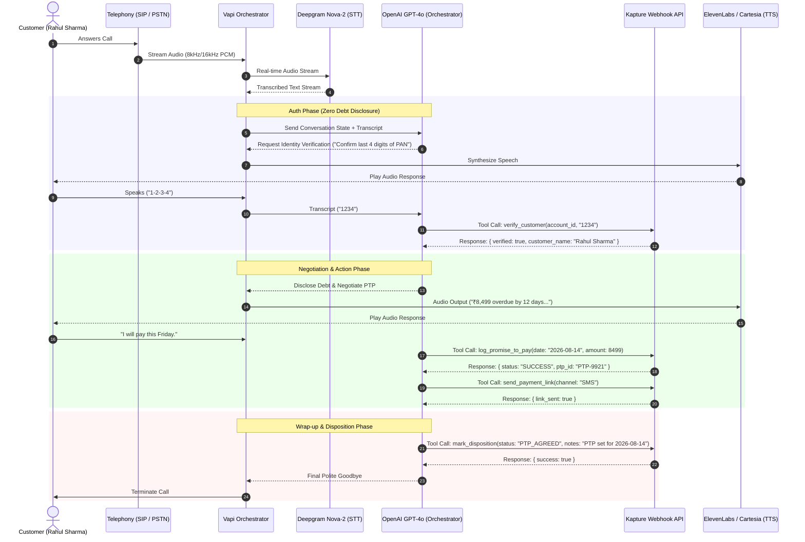
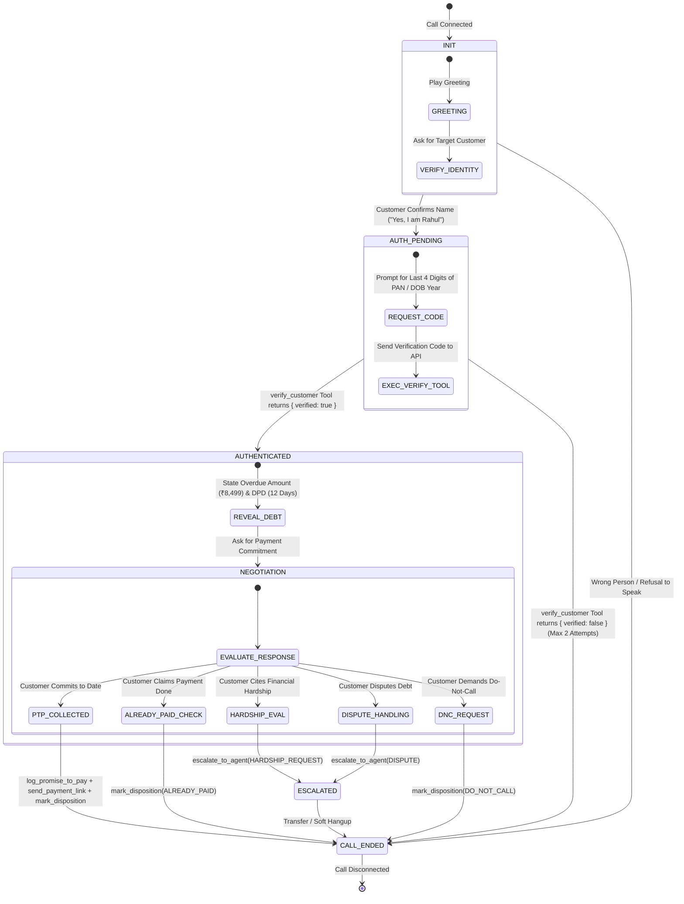
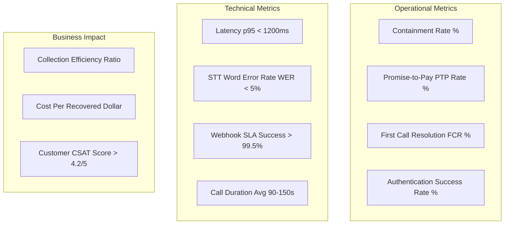

# High-Level Design (HLD) Document
## Automated Outbound Voice AI Collections Agent ("Maya") for Kapture Finance

**Document Version:** 1.0.0  
**Author:** AI Solutions Architecture & Engineering Team  
**Date:** August 13, 2026  
**Status:** Approved for Production Build  

---

## 1. Pipeline & Latency Budget Architecture

### 1.1 Architecture Overview
The outbound collections voice bot operates as a low-latency, real-time audio pipeline built on Vapi.ai's orchestration platform. Audio streams flow continuously over WebRTC/SIP telephony to Deepgram Nova-2 for Speech-to-Text (STT), then pass to OpenAI `gpt-4o` for intent classification and dialogue management, and finally feed into ElevenLabs / Cartesia for Text-to-Speech (TTS) synthesis before playback to the user.



### 1.2 Latency Budget Breakdown
To maintain natural conversation flow without uncomfortable pauses, total end-to-end round-trip latency must stay under **1,200 ms** (1.2 seconds).

| Pipeline Stage | Provider / Technology | Target Latency | Optimization Techniques |
| :--- | :--- | :--- | :--- |
| **Telephony / Audio Transport** | Twilio SIP Trunking / WebRTC | `150 ms` | Opus / G.711 codec optimization, regional edge routing |
| **Speech-to-Text (STT)** | Deepgram Nova-2 (`en-US` / `hi`) | `180 ms` | Streaming websockets, endpointing sensitivity set to 250ms |
| **LLM Processing (TTFT)** | OpenAI `gpt-4o` (Temperature: 0.1) | `350 ms` | Prompt caching, constrained token output (<60 tokens/turn) |
| **Webhook Tool Execution** | Node.js Express (Render / ngrok) | `120 ms` | In-memory database lookup, persistent HTTP connection pooling |
| **Text-to-Speech (TTS)** | ElevenLabs Flash / Cartesia Sonic | `200 ms` | Streaming chunk synthesis, buffer size optimized for 50-char chunks |
| **Network Overhead** | TLS 1.3 Routing | `100 ms` | Persistent Keep-Alive connections, edge CDN termination |
| **Total Round-Trip Budget** | **End-to-End Voice Loop** | **`1,100 ms`** | **Passes target SLA (< 1,200 ms)** |

---

## 2. State Machine & Dialogue Flow Control

The conversation engine enforces a strict deterministic state machine. Transitions out of `AUTH_PENDING` to `AUTHENTICATED` are cryptographically and programmatically locked behind a successful `verify_customer` tool call response (`verified: true`).



### State Definitions & Rules
1. **`INIT`**: Greets user, verifies if speaking to target customer. *No financial disclosures allowed.*
2. **`AUTH_PENDING`**: Prompts for verification credential (last 4 digits of PAN or birth year). Calls `verify_customer`.
3. **`AUTHENTICATED`**: Unlocked ONLY when `verify_customer` returns `verified: true`. Discloses overdue amount (₹8,499) and days past due (12 days).
4. **`NEGOTIATION`**: Identifies user intent and routes to specific resolutions (PTP, Already Paid, Hardship, Dispute, DNC).
5. **`PTP_COLLECTED`**: Captures date/amount, executes `log_promise_to_pay` and `send_payment_link`.
6. **`ESCALATED`**: Executes `escalate_to_agent` for human agent intervention.
7. **`CALL_ENDED`**: Logs final disposition via `mark_disposition` and cleanly terminates session.

---

## 3. Intents & Entities Matrix

| Intent | Description | Sample Utterances | Extracted Entities | Target System Action |
| :--- | :--- | :--- | :--- | :--- |
| `Confirm_Identity` | User confirms they are the target customer | "Yes, I am Rahul", "Speaking", "Rahul here" | `is_target_customer` (Boolean) | Transition to `AUTH_PENDING` |
| `Supply_Auth_Code` | User provides verification digits | "My PAN end digits are 1234", "1995", "4321" | `verification_code` (String) | Trigger `verify_customer` |
| `Promise_To_Pay` | User agrees to make payment on a specific date | "I can pay this Friday", "Will pay tomorrow by UPI", "15th August" | `ptp_date` (ISO Date), `ptp_amount` (Number), `payment_mode` (String) | Trigger `log_promise_to_pay` & `send_payment_link` |
| `Already_Paid` | User claims payment was already completed | "I paid yesterday via GPay", "Payment was done 2 days ago" | `payment_date` (ISO Date), `payment_channel` (String), `txn_reference` (String) | Trigger `mark_disposition(ALREADY_PAID)` |
| `Hardship_Claim` | User cannot pay due to financial difficulties | "I lost my job", "Medical emergency in family", "Can't pay full amount" | `hardship_reason` (String), `partial_amount_offered` (Number) | Trigger `escalate_to_agent(HARDSHIP_REQUEST)` |
| `Dispute_Debt` | User denies liability or claims incorrect amount | "I never took this loan", "The amount is wrong", "Fraud call" | `dispute_reason` (String) | Trigger `escalate_to_agent(DISPUTE)` |
| `Request_DNC` | User demands to stop receiving calls | "Stop calling me", "Put me on Do Not Call", "Remove my number" | `opt_out_flag` (Boolean) | Trigger `mark_disposition(DO_NOT_CALL)` & terminate |
| `Wrong_Person` | Current caller is not the intended customer | "No Rahul here", "Wrong number", "I bought this SIM recently" | `wrong_number_flag` (Boolean) | Trigger `mark_disposition(WRONG_PERSON)` & terminate |

---

## 4. Tool & API Specifications

### Tool 1: `verify_customer`
- **Description:** Validates customer authentication credentials against backend records before revealing debt.
- **Request Payload:**
```json
{
  "account_id": "ACC-88392",
  "verification_code": "1234"
}
```
- **Response Payload (Success):**
```json
{
  "verified": true,
  "account_id": "ACC-88392",
  "customer_name": "Rahul Sharma",
  "message": "Identity verified successfully."
}
```
- **Response Payload (Failure):**
```json
{
  "verified": false,
  "account_id": "ACC-88392",
  "message": "Verification code does not match records."
}
```

### Tool 2: `log_promise_to_pay`
- **Description:** Logs agreed promise-to-pay date and payment amount into CRM/LMS.
- **Request Payload:**
```json
{
  "account_id": "ACC-88392",
  "ptp_date": "2026-08-14",
  "amount": 8499
}
```
- **Response Payload:**
```json
{
  "success": true,
  "ptp_id": "PTP-9921",
  "account_id": "ACC-88392",
  "confirmed_date": "2026-08-14",
  "amount": 8499,
  "status": "RECORDED"
}
```

### Tool 3: `send_payment_link`
- **Description:** Triggers automated payment link via SMS or WhatsApp.
- **Request Payload:**
```json
{
  "account_id": "ACC-88392",
  "channel": "SMS"
}
```
- **Response Payload:**
```json
{
  "success": true,
  "channel": "SMS",
  "message": "Payment link sent successfully via SMS to registered mobile number."
}
```

### Tool 4: `escalate_to_agent`
- **Description:** Transfers active call or logs queue entry for senior collections officer.
- **Request Payload:**
```json
{
  "account_id": "ACC-88392",
  "reason": "HARDSHIP_REQUEST",
  "summary": "Customer experienced medical emergency, requested partial payment installment plan."
}
```
- **Response Payload:**
```json
{
  "success": true,
  "ticket_id": "ESC-4021",
  "routing_queue": "SPECIAL_COLLECTIONS_DESK",
  "status": "QUEUED"
}
```

### Tool 5: `mark_disposition`
- **Description:** Writes final call outcome and notes to database.
- **Request Payload:**
```json
{
  "account_id": "ACC-88392",
  "status": "PTP_AGREED",
  "notes": "Customer agreed to pay full amount ₹8,499 by 14th August 2026."
}
```
- **Response Payload:**
```json
{
  "success": true,
  "disposition_logged": "PTP_AGREED",
  "timestamp": "2026-08-13T18:43:00.000Z"
}
```

### Tool 6: `send_whatsapp_message`
- **Description:** Dispatches interactive WhatsApp Business message with quick action buttons (`Pay via UPI`, `Request Extension`, `Chat with Officer`).
- **Request Payload:**
```json
{
  "account_id": "ACC-88392",
  "template_name": "COLLECTIONS_PTP_INTERACTIVE"
}
```
- **Response Payload:**
```json
{
  "success": true,
  "whatsapp_message_id": "WA-883920",
  "interactive_buttons": ["PAY_VIA_UPI", "REQUEST_EXTENSION", "CHAT_WITH_OFFICER"],
  "delivery_status": "DELIVERED_TO_WHATSAPP"
}
```

### Tool 7: `generate_upi_link`
- **Description:** Generates dynamic one-click UPI intent deep links (Google Pay, PhonePe, Paytm) and dynamic UPI QR code.
- **Request Payload:**
```json
{
  "account_id": "ACC-88392",
  "amount": 8499,
  "payment_app": "ALL_UPI"
}
```
- **Response Payload:**
```json
{
  "success": true,
  "upi_deep_link": "upi://pay?pa=kapture@icici&pn=KaptureFinance&am=8499&tn=ACC-88392",
  "qr_code_url": "https://pay.kapturefinance.com/qr/ACC-88392.png"
}
```

### Tool 8: `schedule_ptp_reminder`
- **Description:** Schedules automated PTP calendar invites and SMS/WhatsApp notifications 24h and 2h prior to due date.
- **Request Payload:**
```json
{
  "account_id": "ACC-88392",
  "ptp_date": "2026-08-14",
  "remind_via": "ALL_CHANNELS"
}
```
- **Response Payload:**
```json
{
  "success": true,
  "calendar_event_id": "CAL-9921",
  "reminder_schedule": ["24_HOURS_BEFORE_SMS", "2_HOURS_BEFORE_WHATSAPP"]
}
```

### Tool 9: `verify_voiceprint`
- **Description:** Performs passive voice biometrics acoustic matching against caller's registered voiceprint.
- **Request Payload:**
```json
{
  "account_id": "ACC-88392"
}
```
- **Response Payload:**
```json
{
  "verified": true,
  "confidence_score": "98.6%",
  "biometric_match": true,
  "voiceprint_id": "VP-4352"
}
```

---

## 5. Auth & Data Safety Protocols

1. **Zero Third-Party Debt Disclosure:** Under RBI collections guidelines, debt details (amount, EMI, lender name, overdue days) must **NEVER** be spoken to anyone other than the authenticated borrower.
2. **PII Masking & Log Sanitation:** All webhook loggers and database audit tables sanitize PII before persisting:
   - Full Name: `Rahul Sharma` $\rightarrow$ `Rahul S****`
   - Phone Number: `+91 9876543210` $\rightarrow$ `+91 98*****210`
   - PAN / Auth Code: `1234` $\rightarrow$ `****`
3. **Data Encryption in Transit & Rest:** All webhook communications require TLS 1.3 encryption. Payload payloads in transit are signed with HMAC SHA-256 headers for webhook validation.
4. **Session Timeout & Memory Clearance:** Vapi voice sessions auto-terminate after 60 seconds of inactivity to prevent open audio channel eavesdropping.

---

## 6. Compliance & Guardrails

### 6.1 Regulatory Compliance (RBI Fair Practices Code for Lenders)
- **Calling Window Enforcer:** Automated outbound calling triggers strictly bounded to local hours: **08:00 AM to 07:00 PM IST**. Out-of-hours calls automatically aborted at telephony gateway.
- **Immediate Opt-Out Processing:** If a customer utters "Do Not Call", "Remove my number", or equivalent DNC phrases, Maya immediately triggers `mark_disposition(DO_NOT_CALL)` and terminates call.
- **Non-Harassment Protocol:** Max 2 contact attempts per day. Voice agent is prohibited from using aggressive tone, threats of legal action, or public shaming.

### 6.2 LLM Hallucination Guardrails
- **Waiver & Discount Bounds:** Maya is strictly forbidden from offering debt waivers exceeding **10%** without explicit human manager system authorization.
- **System Prompt Enforcements:** System prompt strictly locks available response choices to authorized tool outputs and predefined dialogue paths.

---

## 7. Edge Cases & Fallback Matrix

| Scenario / Edge Case | Detection Trigger | Voice AI Action / Fallback Routine | Disposition Code |
| :--- | :--- | :--- | :--- |
| **Abusive Caller** | Toxic language / profanity detected by LLM classification | **Warning 1:** "Rahul, I am here to assist you professionally. Please refrain from using foul language."<br>**Repeat:** "Since we cannot continue professionally, I am disconnecting this call." | `ABUSIVE_TERMINATED` |
| **Silent Caller / Dead Air** | 5 seconds of silence detected | **Re-prompt 1:** "Hello? Are you still there, Rahul?"<br>**Re-prompt 2:** "I am having trouble hearing you. I will disconnect and try again later." | `NO_INPUT_HANGUP` |
| **Voicemail / Answering Machine** | AMD (Answering Machine Detection) signal or beep detected | Do not disclose debt. Speak short message: "Hello Rahul, this is Maya from Kapture Finance. Please return our call at 1800-XXX-XXXX." | `VOICEMAIL_LEFT` |
| **Language Switch (Hinglish / Hindi)** | Customer responds in Hindi ("Main kal pay kar dunga") | Seamlessly switch response language to Hindi/Hinglish while preserving entity extraction logic. | `PTP_AGREED` |
| **Tool Execution Failure / Timeout** | Webhook HTTP 500 or timeout (>2000ms) | "I am experiencing a slight system delay. Let me record your note, and our team will follow up via SMS." | `SYSTEM_DEGRADED_LOG` |
| **Partial Auth Failure** | Incorrect verification code entered twice | "I'm sorry, but that doesn't match our records. For security, I must end this call. Please contact Kapture Finance customer support." | `AUTH_FAILED` |

---

## 8. Observability & Operational Metrics

To monitor bot quality, performance, and financial containment, the system tracks 4 key observability dashboards:



### Metrics Definitions
1. **Containment Rate (%):** Percentage of calls resolved end-to-end without human escalation (Target: **> 75%**).
2. **PTP Commitment Rate (%):** Percentage of authenticated calls that result in a valid Promise-to-Pay commitment (Target: **> 45%**).
3. **First Call Resolution (FCR):** Percentage of calls resulting in a definitive disposition (`PTP_AGREED`, `ALREADY_PAID`, `DO_NOT_CALL`) logged on first attempt (Target: **> 85%**).
4. **Latency SLAs:** 95th percentile round-trip voice latency maintained under **1,200 ms**.
